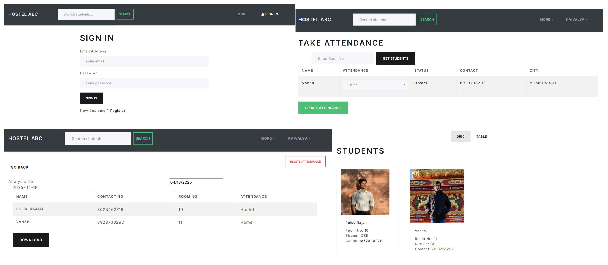

# Hostel Management Application

Created using MERN Stack with Redux


## Installation

```bash
npm install --legacy-peer-deps
cd frontend && npm install --legacy-peer-deps
```

### Configure `.env` file

```env
NODE_ENV=development
PORT=5000
MONGO_URI=your_mongo_connection_string
JWT_SECRET=your_jwt_secret_key
```

## Running the App

Start backend server:

```bash
npm start
```

Start frontend:

```bash
cd frontend
npm start
```

## Features

- [x] Register/Login Screens
- [x] Student Details
- [x] Add Student
- [x] Edit/Delete Student Details
- [x] Update Student Whereabouts
- [x] Daily Attendance Tracking
- [x] Display Attendance Details
- [x] Download CSV of Attendance
- [x] Delete Attendance of Previous n Days
- [x] Control User List
- [x] Edit User Admin Status
- [x] Data Controlled by Only Admins


## 👨‍💻 Developer

**Kaivalya Shah**  
Email: [kaivalyashah192@gmail.com](mailto:kaivalyashah192@gmail.com)  
GitHub: [github.com/Kaivalya192](https://github.com/Kaivalya192)  
LinkedIn: [linkedin.com/in/kaivalya192](https://www.linkedin.com/in/kaivalya192/)

**Vidit Paladiya**
Email: [viditpaladiya@gmail.com](mailto:viditpaladiya@gmail.com)
GitHub: [github.com/ViditPaladiya](https://github.com/ViditPaladiya)  
LinkedIn: [linkedin.com/in/vidit-paladiya-629416262](https://www.linkedin.com/in/vidit-paladiya-629416262)